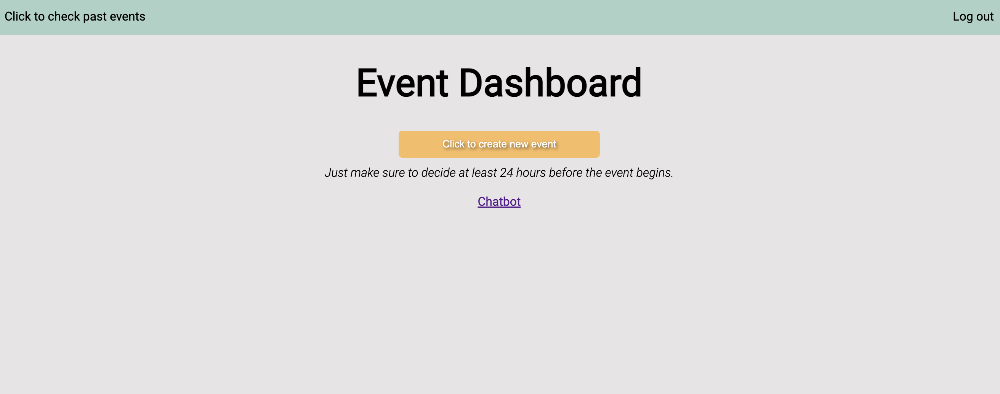
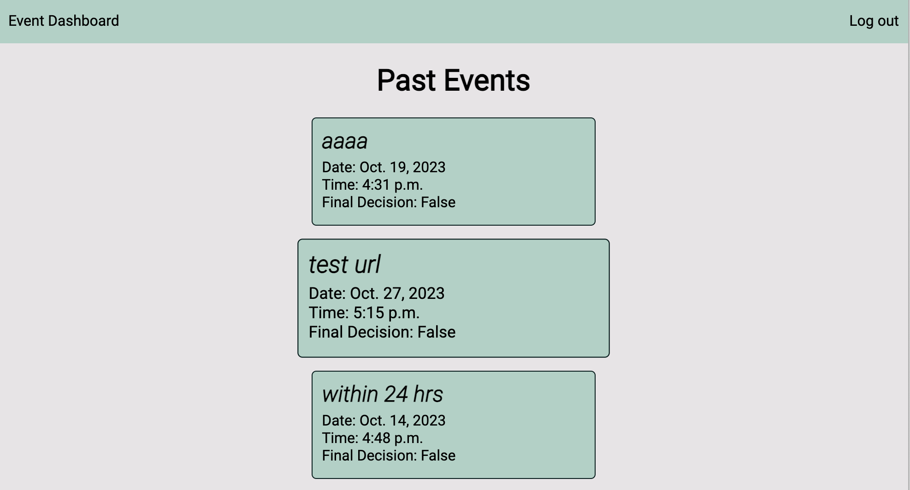
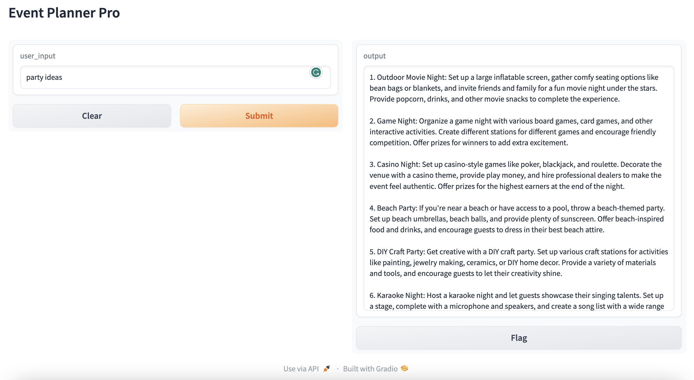

# GoNoGo: A Full Stack Django app 

This is a full-stack app that allows friends to schedule events and freely decide whether to attend or not, without any social pressure!

If the majority of participants for the same event choose not to attend, the event will be canceled. This approach ensures that people don't feel pressured to attend, as no one knows who canceled!
## Key Features

- **Django:** For performing create, read, update, and delete (CRUD) operations
- **OpenAI:** Leverage OpenAI API to generate ideas for the user as a chatbot function.

## A Glimpse into GONOGO

**Home Page**

 

**Create new event**

 

**Chatbot**

 

Stay tuned for more updates!